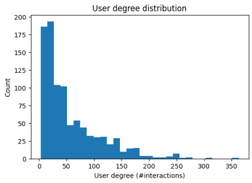
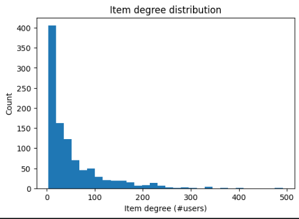

# Graph Mining Course Project Progress Report

**Isfahan University of Technology – Faculty of Computer Engineering**
**Course:** Graph Mining [4041]
**Instructor:** Dr. Zeinab Maleki
**Submission Date:** 1404/10/14
**Project Title:** Graph-based Recommendation using Graph Neural Networks (GNNs) on a User–Item Interaction Graph

## Student Information

* **Student Name(s):** Kimia Nikooei – Mobina Massah
* **Student ID(s):** 40132933 – 40133803
* **Email(s):** [k.nikooei@gmail.com](mailto:k.nikooei@gmail.com) – [m.massah@ec.iut.ac.ir](mailto:m.massah@ec.iut.ac.ir)

---

## Executive Summary 

This progress report summarizes the work completed toward building a graph-based recommender system using Graph Neural Networks (GNNs), aligned with the original proposal. We selected the MovieLens 100K dataset and converted explicit ratings into implicit feedback by keeping positive interactions (ratings ≥ 4). To improve learning quality, sparse users/items were iteratively filtered, and IDs were remapped into contiguous indices for compatibility with PyTorch Geometric. We then performed a time-aware leave-one-out split per user to create train/validation/test sets and constructed a bipartite user–item interaction graph from training edges only to avoid data leakage. Structural analysis confirmed the graph is fully connected with no isolated nodes.
As baselines and initial models, we evaluated a classical Matrix Factorization (MF-ALS) recommender and implemented three GNN-based link prediction models: GCN, GraphSAGE, and LightGCN using BPR loss and negative sampling. Quantitative results show MF-ALS currently achieves the best performance (Test Recall@10=0.1066, NDCG@10=0.0533). Among GNNs, GCN performs best (Test Recall@10=0.0842). Given the preliminary results obtained from both GNN-based approaches and the baseline model, the project is now prepared to proceed to the final comparison and detailed analysis phase. At this point, the focus has been on implementation and evaluation, and no in-depth comparative analysis has yet been performed.

---

## Progress on Objectives 

### Objective 1: Dataset Preparation and Bipartite Graph Construction

Status: Completed.This objective has been completed. We used MovieLens 100K, which contains 100,000 explicit ratings from 943 users on 1,682 movies. The raw file was loaded into a Pandas DataFrame for preprocessing and exploratory analysis. Ratings were converted to implicit feedback by retaining only interactions with rating ≥ 4 as positive edges. To reduce noise and improve the stability of learned representations, we performed iterative sparse filtering to remove users and items with too few interactions until the dataset reached a stable state.
After preprocessing, the final filtered dataset contains **938 users**, **1008 items**, and **54,413 positive interactions**. We computed the sparsity of the user–item interaction matrix and found it remains highly sparse (≈94% empty), which is typical for real-world recommendation and motivates collaborative and graph-based approaches.

### Objective 2: GNN-based Recommendation via Link Prediction

Status: Completed.This objective is partially completed and on track. We formulated recommendation as **link prediction** over a bipartite user–item graph. The training graph was built using training interactions only. We implemented **GCN**, **GraphSAGE**, and **LightGCN** to learn node embeddings for users and items through message passing.
Since edge files store item indices in the range 0..1007 while PyG numbers item nodes after user nodes, we applied an offset consistently during training and evaluation:
**item_node_id = item_idx + 938**.

### Objective 3: Evaluation and Baseline Comparison

Status: In Progress.This objective is partially completed with solid preliminary findings. At this stage, evaluation results have been obtained **separately for each model**, without performing any direct cross-model comparison. We evaluated the models using a strict **time-aware leave-one-out** protocol: for each user, the most recent interaction is used for testing, one recent interaction for validation, and the remaining interactions for training. The evaluation is **user-centric**, with training-seen items excluded from recommendation lists to prevent data leakage. We computed **Recall@K, Precision@K, and NDCG@K** for K ∈ {5, 10, 20}. In the next phase of the project, these evaluation results will be systematically compared and analyzed to assess the relative performance of the baseline and GNN-based models.

---

## Work Accomplished 

### Dataset Preparation and Analysis

We selected MovieLens 100K due to its manageable size and wide adoption in recommender system research. The original ratings file was loaded and analyzed; rating distribution was skewed toward higher scores, so we treated the task as implicit recommendation. We converted explicit ratings to implicit feedback by keeping only interactions with rating ≥ 4, removing ambiguous or negative preferences.
To reduce sparsity-related noise, we applied iterative sparse filtering: users/items with very few interactions were removed repeatedly until no new sparse entities remained. This step avoids unstable training caused by near-isolated nodes and improves the meaningfulness of learned patterns.
We then remapped user and item IDs into contiguous indices (0..N−1) and stored both forward and inverse mappings (user2idx, idx2user, item2idx, idx2item) to ensure reproducibility and interpretability.

### Graph Construction and Structural Statistics

We performed a time-aware leave-one-out split per user to create train/validation/test sets: **Train: 52,537 interactions**, **Validation: 938**, **Test: 938** (one held-out item per user for validation and test). The training interaction graph is a **bipartite graph** with users and items as two node types and positive interactions as edges.
The training graph contains **1946 nodes** (938 users + 1008 items) and **52,537 edges** (undirected/bidirectional representation yields `edge_index` size (2, 105,074) in PyG). Degree analysis showed average user degree ≈ **56.0** and average item degree ≈ **52.1**. Connectivity analysis confirmed a **single connected component** containing all nodes and no isolated nodes—an important property for effective message passing in GNNs. A small bipartite subgraph visualization was generated as a sanity check to verify that edges only connect user-to-item (no user–user or item–item edges).

**User Degree Distribution.**  
The distribution of user degrees in the bipartite interaction graph shows the number of interactions per user.

**Item Degree Distribution.**  
The distribution of item degrees illustrates how frequently items are interacted with by users.

### Implementation Details

We implemented a classical baseline model and multiple GNN-based models.
**Baseline:** Matrix Factorization using **ALS** trained only on the interaction matrix (no graph structure).
**GNN Models:** **GCN**, **GraphSAGE**, and **LightGCN**, trained on the PyTorch Geometric graph. We used dot-product scoring and trained with **BPR loss** plus **negative sampling** (10 negatives per positive). During evaluation, training-seen items were masked for each user to mimic real recommendation settings.

### Preliminary Results

**Baseline MF (ALS) – Validation/Test Metrics**

| Model    | Split |  K |   Recall@K | Precision@K |     NDCG@K |
| -------- | ----- | -: | ---------: | ----------: | ---------: |
| MF (ALS) | Val   |  5 |     0.0928 |      0.0186 |     0.0585 |
| MF (ALS) | Val   | 10 |     0.1279 |      0.0128 |     0.0699 |
| MF (ALS) | Val   | 20 |     0.2186 |      0.0109 |     0.0928 |
| MF (ALS) | Test  |  5 |     0.0586 |      0.0117 |     0.0380 |
| MF (ALS) | Test  | 10 | 0.1066 |  0.0107 | 0.0533|
| MF (ALS) | Test  | 20 |     0.1908 |      0.0095 |     0.0746 |

**GNN Models – Test Summary (K=10)**

| Model     | Recall@10 | Precision@10 | NDCG@10 |
| --------- | --------: | -----------: | ------: |
| GCN       |    0.0842 |       0.0084 |  0.0413 |
| GraphSAGE |    0.0469 |       0.0047 |  0.0222 |
| LightGCN  |    0.0256 |       0.0026 |  0.0115 |

---

## Challenges Encountered and Resolutions 

* **Challenge 1: High sparsity in user–item interactions**
  The interaction matrix remains extremely sparse (≈94% empty), which can weaken signal strength, increase variance in learning, and cause unstable training for graph models.
  **Resolution:** We applied iterative sparse filtering to remove very low-interaction users/items and used negative sampling with BPR loss to improve ranking learning under implicit feedback.

* **Challenge 2: Environment and dependency issues on macOS (PEP 668 and safe loading in PyTorch)**
  Installing packages system-wide triggered “externally-managed-environment” restrictions, and loading the PyG graph with recent PyTorch defaults caused a weights-only loading error.
  **Resolution:** We created a dedicated Python virtual environment (venv), installed dependencies inside it, and loaded the PyG graph using `torch.load(..., weights_only=False)` after installing torch-geometric.

* **Challenge 3: GNN performance sensitivity and simplified LightGCN propagation**
  GNN models are highly sensitive to hyperparameters and correct message normalization. Our simplified LightGCN propagation did not include full degree normalization, which likely contributed to lower performance.
  **Resolution/Next steps:** We will implement degree-normalized propagation for LightGCN, tune embedding size, number of layers, negative ratio, and early stopping to improve generalization and close the gap with MF.

---

## References 

1. X. He, K. Deng, X. Wang, Y. Li, Y. Zhang, and M. Wang,  
   “LightGCN: Simplifying and Powering Graph Convolution Network for Recommendation,”  
   in *Proceedings of the 43rd International ACM SIGIR Conference on Research and Development in Information Retrieval (SIGIR)*, 2020, pp. 639–648.

2. X. Wang, X. He, X. Wang, F. Feng, and T.-S. Chua,  
   “Neural Graph Collaborative Filtering,”  
   in *Proceedings of the 42nd International ACM SIGIR Conference on Research and Development in Information Retrieval (SIGIR)*, 2019, pp. 165–174.

3. R. van den Berg, T. N. Kipf, and M. Welling,  
   “Graph Convolutional Matrix Completion,”  
   *arXiv preprint* arXiv:1706.02263, 2017.

---

**Student Signature(s):** Kimia Nikooei – Mobina Massah

**Date:** 1404/10/14

